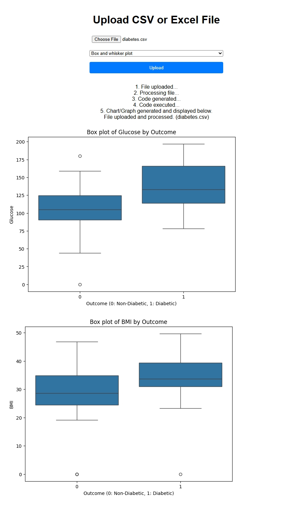
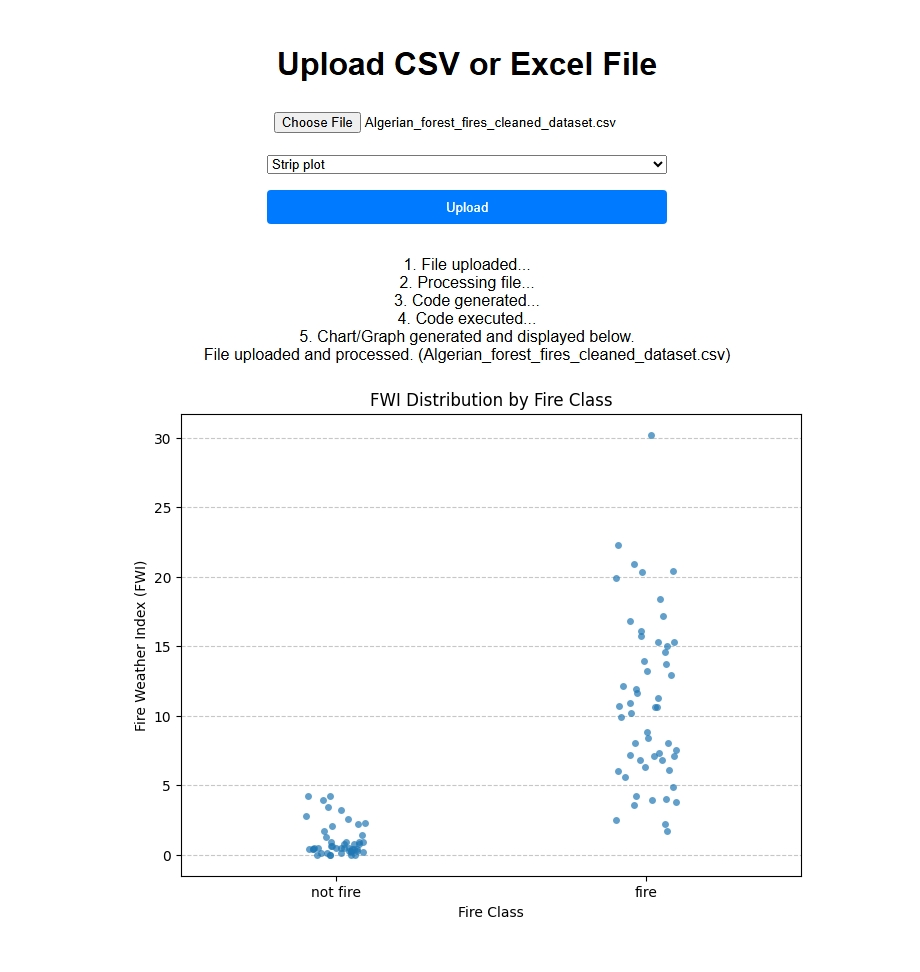
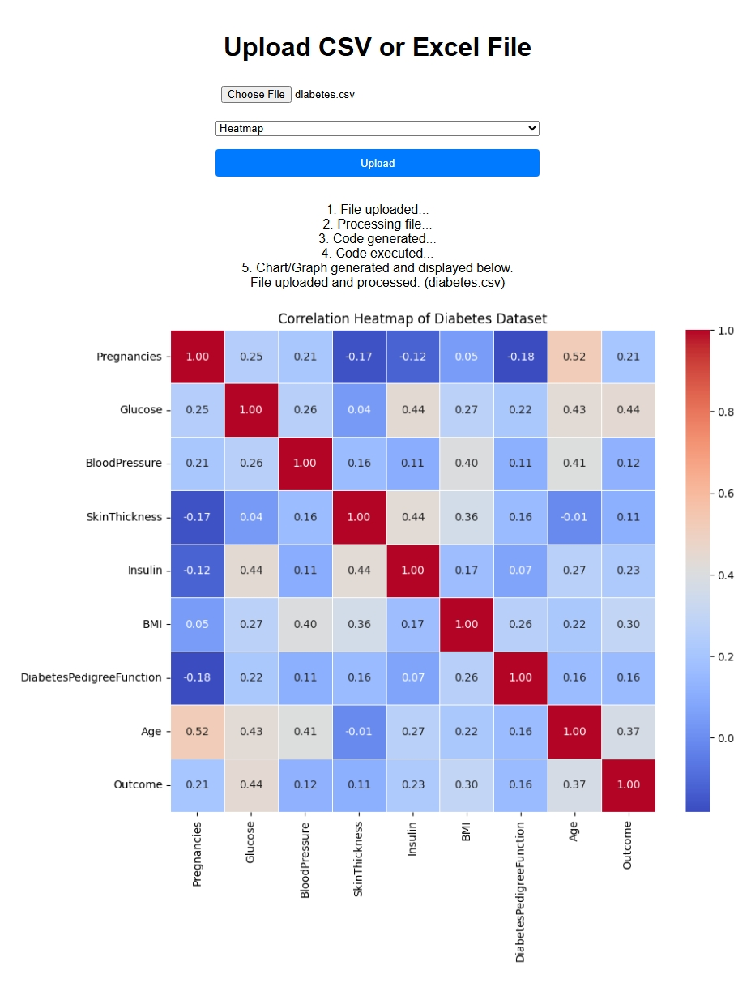
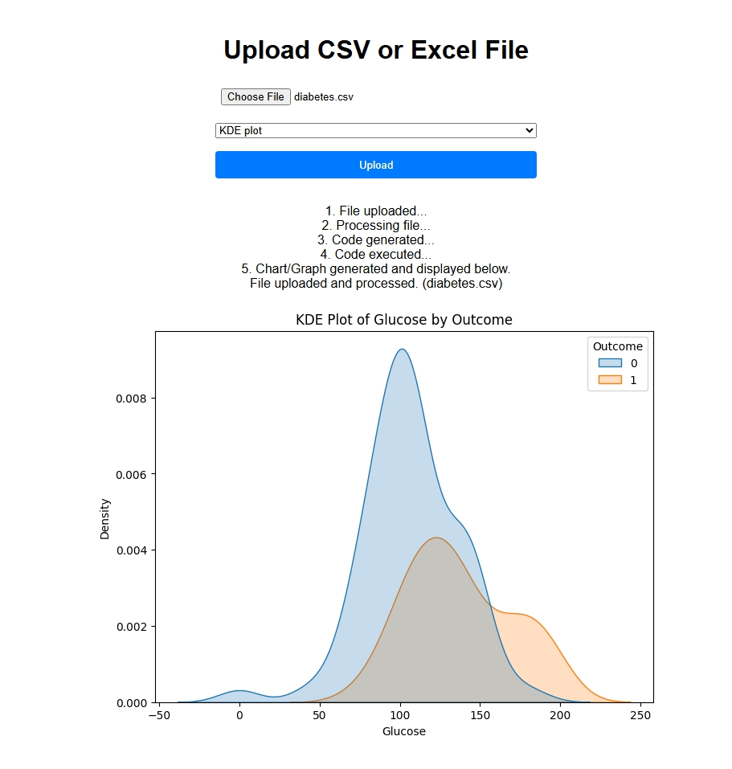
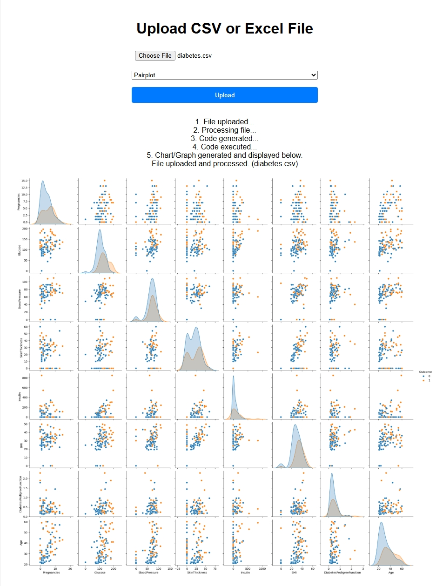
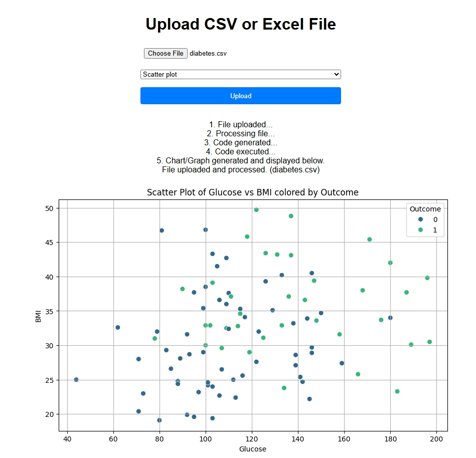

# AI-Powered Data Analysis and Visualization App 🚀

An interactive web application that uses AI to analyze data files and generate visualizations. Built with FastAPI, Gemini AI, and E2B Sandbox.

## 🌟 Features

- 📊 Upload CSV and Excel files
- 🤖 AI-powered data analysis
- 📈 Automatic chart generation
- 🎨 Multiple visualization types:
  - Line charts
  - Bar charts
  - Scatter plots
  - Pie charts
  - Box and whisker plots
- 🔄 Real-time progress tracking
- 🛡️ Secure code execution in sandbox

## 🚀 Quick Start

### Prerequisites

```bash
python -m venv env
env\Scripts\activate
pip install -r requirements.txt
```

### Environment Setup

Create a `.env` file in the project root:

```env
GOOGLE_API_KEY=your_gemini_api_key
E2B_API_KEY=your_e2b_api_key
```

Get your API keys:
- [Gemini API Key](https://makersuite.google.com/app/apikey)
- [E2B API Key](https://e2b.dev/dashboard)

### Running the App

```bash
uvicorn app:app --reload
```

Visit `http://localhost:8000` in your browser! 🎉

## 🎯 How to Use

1. **Upload Your Data**
   - Click "Choose File" and select a CSV or Excel file
   - Choose your preferred chart type from the dropdown
   - Click "Upload"

2. **Watch the Magic**
   - 📁 File Upload Status
   - 🔄 Processing Updates
   - 🤖 AI Code Generation
   - 🖼️ Chart Rendering

3. **View Results**
   - See your data visualized automatically
   - Check the generated analysis code
   - Download or share the results

## 🖼️ Demo

Below are some screenshots showcasing the app in action:

| Home Page | File Upload | Chart Selection |
|---|---|---|
|  |  |  |

| Chart Output | Progress | More Charts |
|---|---|---|
|  |  |  |

| Example |  |
|---|---|
|  |  |

## 📁 Project Structure

```
├── app.py              # FastAPI application
├── src/
│   ├── services/      # AI and sandbox services
│   ├── pipeline/      # Data processing pipeline
│   └── util/          # Utility functions
├── static/            # CSS and JavaScript
├── templates/         # HTML templates
└── temp_uploads/      # Temporary file storage
```

## 🛠️ Technologies Used

- FastAPI - Web framework
- Google Gemini AI - Code generation
- E2B Sandbox - Secure code execution
- Pandas - Data processing
- Matplotlib/Seaborn - Visualization
- HTML/CSS/JavaScript - Frontend

## 🤝 Contributing

1. Fork the repository
2. Create your feature branch: `git checkout -b feature/amazing-feature`
3. Commit your changes: `git commit -m 'Add amazing feature'`
4. Push to the branch: `git push origin feature/amazing-feature`
5. Open a Pull Request

## ⚠️ Error Handling

Common issues and solutions:

- **File Type Error**: Only CSV and Excel files are supported
- **API Key Error**: Make sure both API keys are set in `.env`
- **Timeout Error**: Large files may need more processing time
- **Chart Error**: Ensure data is suitable for selected chart type

## 📝 License

This project is licensed under the MIT License - see the [LICENSE](LICENSE) file for details.

## 🙏 Acknowledgments

- Google Gemini AI for code generation
- E2B for secure code execution
- FastAPI community
- Open-source data visualization libraries

---
Made with ❤️ and AI